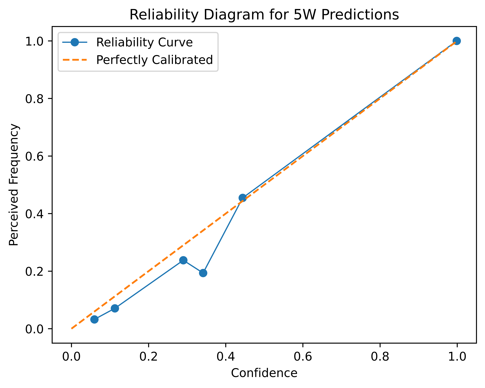

# How to alleviate chatbot hallucinations:   from the theory in "Calibrated Language Model must Hallucinate"

### M. Feng | D. de Wilde | I. van Dort | S. Yildiz | L. Schuenemann

---

In this blog post, we discuss, reproduce, and extend on the findings of the paper titled ["Calibrated Language Model must Hallucinate"](https://arxiv.org/pdf/2311.14648). The main claim of the paper is that pretrained language models (LMs), even under ideal conditions and statistical calibration, are inherently bound to hallucinate to a certain extent.

The purpose of this blog post is threefold: 
1. Help other researchers understand the theory presented in the paper. 
2. Verify the authors' claims by reproducing the results. 
3. Extend on discussion points of the paper.

---

## Language Models Hallucinate
As language models (LMs) grew in popularity, people have been noticing a large amount of false information generated by them. One common example is non-existent article references. Those mistakes have been described as LMs' "hallucinations", which have caused problems in different fields where LMs are applied, especially in fields such as healthcare, where hallucinated information can be life-threatening. The study by Kalai et al. [1] provided a mathematical analysis of the problem and derived a lower bound on the hallucination rate of LMs, showing that there is a trade-off between calibration accuracy and hallucination rate. This theoretical work presented statistical insights on hallucination and we would like test whether the predictions are true. By doing so, we are seeking for better strategies in avoiding hallucinations when needed.

## <a name="recap">Hallucination</a>

> This section first introduces the phenomenon of hallucination in language models, and then dip into the theory on its lower bound. 

One may wonder, what is defined as a hallucination in this context? As defined in the Merriam-Webster (2023) dictionary, it is “a plausible but false or misleading response generated by an artificial intelligence algorithm.” Imagine an AI generates the following statement and attributes it to Albert Einstein: “The future of humanity lies in the harmony between technology and nature.” While this sounds like something Einstein might say, given his thoughtful reflections on science and society, there’s no record of him actually saying these exact words. This would be a clear example of an AI hallucinating a quote—creating a plausible but fictitious statement and attributing it to a famous individual. 

Hallucinations may seem harmless in the the above scenario, but can cause harzards in others. Suppose a user asks an AI for guidance on treating a severe allergic reaction, and the AI mistakenly generates the following response: “Taking a high dose of aspirin immediately is an effective way to mitigate severe allergic reactions.” Giving medical guidance like this can be not only inccorect but potentially dangerous.

The study by Zhang et al. (2023) [5] categorizes hallucinations into input-conflicting, context-conflicting, and fact-conflicting types. It also discusses the main challenges like handling huge training datasets, the flexibility of LMs, and subtle errors. They also review different ways to evaluate and reduce hallucinations, such as improving training with factual data and checking facts after generating text. This shows how hard it is to deal with hallucinations as LLMs keep improving quickly

To better understand the nature of AI hallucination and manage its consequences, a next question one may ask is how often can AI hallucinate. A reasonable and formal approach to answer this question is to find a lower bound to the rate of hallucinations, which is where Kalai et al. worked on in their paper [1].
<!-- The next question might be what caused this hallucination? -->

### The lower bound for hallucination rate
In the section above we explain what a hallucination is. The paper describes a lower bound for the hallucination rate.  A lower bound is the least value that a parameter or estimator can take. It's a threshold below which values are not considered realistic given the model or constraints. Lower bounds help define the limitations of estimators and assess the accuracy and dependability of statistical estimates. For instance, in the context of confidence intervals, the lower bound marks the lowest value within the interval.

#### Missing facts (missing mass)
The concept of "missing mass" in the paper relates to the probability associated with unobserved outcomes in a sample. When drawing n independent and identically distributed (i.i.d.) samples from an unknown distribution p over a large number of arbitrary factoids (such as the 5W examples and references), there are likely to be some factoids that do not appear in the training data. The missing mass quantifies the probability of encountering these unseen factoids in future samples. In the paper they use the following notations:

$U$: subset of facts that were unobserved in the $n$ training samples

$p(U)$: the fraction of future samples from this fact distribution $p$ that were not observed in the n training samples

#### MonoFacts estimator of missing fact rate
The Good-Turing estimate of the missing mass [2] represents the fraction of samples (or facts, in our case) that appear exactly once in the training data. In our study, we refer to this as the MonoFacts estimator, as showed in equation 1. Equation 2 states that the MonoFacts estimater provides an estimate of the missing mass that is very close to the true missing mass. Specifically, meaning that as the number of samples n increases, the estimation error decreases at a rate proportional to $\sqrt{1 / n}$. This result is significant because it guarantees that the MonoFacts estimator is a reliable method for estimating the missing mass. The bound indicates that the estimate will be very close to the true value, especially as the number of samples grows, and this reliability holds with high probability for any distribution p.

$$
\hat{MF} := \frac{\text{Number of facts appearing exactly once in training data}}{n} \qquad \qquad \text{(equation 1)}
$$

$$
|p(U)-\widehat{M F}|=\tilde{O}(\sqrt{1 / n}) \qquad \qquad \text{(equation 2)}
$$

#### Hallucination rate (lower bound)
In equation 3 the lower bound of the hallucination rate is given. 

$$
\text{Hallucination rate} \geq \hat{MF} - \text{Miscalibration} - \frac{300|\text{Facts}|}{|\text{Possible hallucinations}|} - \frac{7}{\sqrt{n}}
 \\ \text{(equation 3)}$$

First we can see that the hallucination rate is lower bounded by the MonoFact rates. Meanwhile, there are three other terms which can reduce this lower bound. The first is miscalibration rate, which quantifies how calibrated a model is. The less a model is calibrated, the higher the miscalibration rate, the smaller the lower bound. 

The second term is the ratio between the number of facts and possible hallucinations, scaled by 300. Specifically, this refers to the ratio of the number of arbitrary facts to similar pieces of information that are false. If there are more facts than possible hallucinations, the lower bound will be decreased. The influence of the term decreases exponentially with the number of samples/facts, because the growth of possible but false information often follows an exponential distribution. Each additional piece of information (like an ingredient in a dish or a guest at an event) multiplies the number of plausible narratives or descriptions exponentially. For example, consider a simple model where each fact about a restaurant could vary independently (e.g., location, type of cuisine, ambiance). The combinations of all these varying elements lead to an exponential growth in the number of plausible but untrue descriptions compared to the limited number of truthful combinations.

Finally, the last term introduces a correction based on the sample size n. It makes the lower bound small when the sample size is small. If the sample size is large, the influence of this term is minimal.

From the equation, we can see why a model must hallucinate if they are calibrated: Since the last two terms are very small with large data sets, the lower bound of hallucination rate is mainly determined by the MonoFact estimator and the miscalibration rate. If the model is calibrated, the miscalibration rate will be low and the hallucination rate will be determined by the MonoFact estimator of the missing facts, which is very likely to be above zero.

## <a name="discover"> Calibration</a>

> This section explain what calibration is, and why it is relevant to our study.

Calibration is to make the confidence of a prediction being accurate close to the actual prediction accuracy. For example, given 100 predictions, each with confidence of 0.8, we expect that 80 should be correctly classified (Guo2017 et al. [6]). In other words, we want the confidence level of a model to match the true performance of the model.

In the context of LMs, we want to make sure the distribution of the training data is aligned with the distribution of language in reality. Instead of calibrating LMs at token level, the paper adapts semantic level calibration, which considers the probability distribution over pieces of information (facts or hallucinations) contained in the text. Specifically, they define a model as calibrated if for any probability $z \in[0,1]$, among the pieces of information it generates with probability $\approx z$, such information occurs on average in $\mathrm{a} \approx z$ fraction of naturally occurring language (ideally the distribution from which training data was drawn).

<!-- <table align="center">
  <tr align="center">
      <td></td>
  </tr>
  <tr align="left">
    <td colspan=2><b>Figure 3.</b> Asymmetric reverse process (Asyrp) visualization [8].</td>
  </tr>
</table> -->

## <a name="architecture"> Trade-off between Calibration and hallucination </a>

> This section shows the main finding about the trade-off between calibration and hallucination and how the authors derive a theoretical lower bound which shows this relationship.

If an LM is calibrated to reflect realistic distributions of language, it will inevitably include representations of less frequent, arbitrary facts since those are present in the full spectrum of language usage in real world. 
Natural language is highly dimensional and variable. Even slight changes in word choice or sentence structure can lead to entirely new meanings and text outputs. A calibrated language model, attuned to a realistic and broad probability distribution, will inherently be able to explore this high-dimensional space more effectively, thereby generating diverse and previously unseen text, and hence, has a high chance of being incorrect. 

The paper's conclusion suggests that while pretraining LMs for good predictive performance may lead to calibration, additional post-training may be necessary to reduce the rate of hallucination, potentially at the cost of perfect calibration.

## <a name="architecture">Testing the theory: Systematic and arbitrary facts</a>

> This secion explain our research objective on testing the prediction on the hallucination rate difference between systematic and arbitrary facts

In the paper, the theory is based on a very minimalistic setting. Here, we would like to test whether the theory holds, in different settings ranging from systematic to arbitrary facts, of varying complexity. Specifically, we would like to see whether the theoretical prediction on differences between hallucination rate on systematic facts and arbitrary facts are true. 

#### Arbitrary facts
Factoids are arbitrary pieces of information which are each either true (facts) or false (hallucinations). Arbitrary facts are pieces of information whose truth or falsity cannot be systematically verified using a set of rules or existing knowledge within the training data. They are often specific, contingent, and context-dependent.
For example, a statement like “Alex had lunch with Sam at Cafe Deli on March 15” is arbitrary because, without specific external data confirming this event, there’s no systematic way to verify its truth. The verification of such facts often requires specific, external, and sometimes unavailable information.

These facts are typically unique or rare occurrences and do not follow predictable patterns that can be inferred through general rules or common knowledge. The missing fact rate for arbitrary facts therefore can be relatively high because the vast diversity and specificity of possible arbitrary facts make it unlikely for the training data to cover all or even most of them. 

Because arbitrary facts are not governed by predictable rules and often lack redundancy in the data (i.e., they don’t appear frequently or consistently), language models have fewer clues to learn their true context and relevance. This makes it more likely for models to “hallucinate” or generate arbitrary facts that are plausible but not accurate.

#### Systematic facts
Systematic facts are those that can be validated through logical deduction, established rules, or consistent patterns in the data. They are generally based on objective, verifiable data. For example, mathematical truths (e.g., “5 + 7 = 12”) or scientific facts that follow from established principles (e.g., “water boils at 100°C at sea level”) are systematic because their truth can be consistently verified through empirical evidence or logical reasoning.

These facts are predictable and repeatable. They can often be derived or confirmed through analysis or existing knowledge bases without needing external confirmation of each specific instance. 

Because of the systematic nature of the facts, repeating these patterns are more straightforward, leading to a lower missing fact rate and rate of hallucination.

### Our contribution

While the paper presents a theoretical framework demonstrating that language models, even when optimally trained and calibrated, are inherently prone to hallucinations, particularly with arbitrary facts, the authors did not empirically test their claims, leaving a gap in understanding how these theoretical findings translate into real-world performance. To address this, we set out to empirically verify these claims by testing the predictions in more realistic settings, using different datasets to measure hallucination rates. By doing so, we aim to validate the theoretical lower-bound on hallucination rates, in various settings containing systematic and arbitrary facts. We will expand on this in the experimental setting.

## <a name="reproduction">Experimental setting</a>

> This section explains our setting for the experiments. We trained three different models using different datasets: a math dataset, a 5W dataset, and an abstract-title dataset. Each dataset is designed to test different aspects of fact generation and estimation accuracy. Here, we provide an overview of our datasets, the models we trained, and the evaluation metrics used.

#### Math Dataset

**Rationale:** Mathematical facts are highly systematic and verifiable. Arithmetic equations follow strict rules, making them ideal for testing hallucinations in a controlled environment. Any deviation from the expected output can be easily identified as a hallucination.

**Characteristics:** This dataset consists of simple arithmetic equations involving addition, subtraction, and multiplication. Each equation is generated using random integers (ranging from 0 to 10) and operators, ensuring a diverse but systematic set of facts.

**Purpose:** To test the model's ability to handle systematic facts and verify whether calibration affects hallucination rates in such a predictable context.

#### 5W Dataset

**Rationale:** The 'who-what-when-where-why' (5W) structure introduces arbitrary facts. While the format is consistent, the actual content varies, making it easy for the model to generate plausible sounding, but factually incorrect information. 

**Characteristics:** This dataset includes sentences generated from combinations of names, meals, times, and locations, resulting in a wide variety of unique but plausible sentences. Why was omitted, for efficiency purposes.

**Purpose:** To examine the model's performance and hallucination tendencies in a semi-structured context, where some level of predictability exists but is interspersed with variability.

#### Abstract-Title Dataset

**Rationale:** Scientific paper abstracts and titles represent a more complex and less predictable set of facts. Titles often summarize key points of the abstracts, requiring the model to grasp nuanced information and context.

**Characteristics:** This dataset comprises metadata from the arXiv repository, including abstracts and titles of scientific papers. It introduces a high degree of variability and complexity, challenging the model to generate accurate titles based on given abstracts.

**Purpose:** To test the model's capability in handling complex, less structured data where arbitrary facts are more likely to appear, thus providing a robust test for the theory.

For the math dataset we developed a Python script that generates a large set of simple arithmetic equations along with their answers. This dataset includes operations such as addition, subtraction, and multiplication. For every generated equation a random operator was chosen and two integers randomly sampled between 1 and 10. As a result we have a dataset containing 20,000 equations.

In order to construct the 5W dataset as outlined in the referenced paper, we aimed to produce samples in the ‘who-ate-what-when-where-why’ structure. Our initial step involved the creation of distinct word lists for each component of this structure. Specifically, we compiled a list of 40 different names for the ‘who’ segment, 40 diverse meals for the ‘what’ section, 25 temporal expressions for the ‘when’ category, and 10 varied locations for the ‘where’ element. Subsequently, these words were randomly combined to yield a total of 20,000 unique sentences. For the sake of simplifying the model training process and enhancing overall clarity, we ignored the ‘why’ component from our dataset. The source code for the process could be seen in the repository.

For our abstract-title dataset, we used the arXiv dataset provided by Cornell University on Kaggle [3]. This comprehensive dataset contains metadata for scientific papers, including titles, abstracts, authors, and categories from the arXiv repository. We preprocessed the data so it includes entries with the following fields: id, authors, title, and abstract. To ensure the quality and manageability of the dataset, abstracts longer than 200 words were filtered out. The final dataset consists of 20,000 entries, selected to maintain computational feasibility while providing sufficient data for training and evaluation.

#### Preprocessing
For the math dataset we followed very simple preprocessing steps by just applying a pretrained tokenizer (bert-base-uncased).

For training on 5W dataset, the data was fed into the model batches of 16 sentences at a time. We utilized the BERT tokenizer (bert-base-uncased) for tokenization. During the training, each token had a 20% chance of being masked. 

The preprocessing steps for the Abstract-Title model included tokenization and formatting of the text data. We used the BERT tokenizer (bert-base-uncased) to tokenize the text, with a simplification step where periods were removed from the abstracts to clean the data. Each data entry was then concatenated in the format of abstract[SEP]title to create the input for the model.

### Model
We used BertForMaskedLM model configured with BERT [4] Base parameters. All configurations  have 12 hidden layers with 12 attention heads, a hidden size of 768, an intermediate size of 3072, a dropout rate of 0.1 for hidden states and attention, and position embeddings of 512.

#### Training Procedure
A DataLoader was used to handle the training data, employing a DataCollatorForLanguageModeling with a masking probability of 0.2 to facilitate masked language modeling. To optimize the training process, we used the ADAMW optimizer, which is well-suited for handling weight decay in conjunction with adaptive learning rates. The models were trained with the training parameters showed in table 1.

| Hyperparameter   | Math      | 5W    | Citations |
|------------------|-----------|-------|-----------|
| Batch Size       | 16        | 16    | 16        |
| Epochs           | 20        | 20    | 71        |
| Learning Rate    | 3e-5      | 3e-5  | 4e-5      |
| Weight Decay     | 0.01      | 0.01  | 0.01      |

    <b>Table 1.</b> Training parameters per model.

### Evaluation Procedure

Results on the math dataset were evaluated via a validation set of 2,000 samples from the same distribution as the train data. During training, it is evaluated in the task of masked token prediction. 

In the evaluation phase of 5W model, we masked one random token in each sentence of the evaluation set and tasked the model with predicting the masked token. To assess accuracy, the token with the highest logit value produced by the model was considered as the model’s prediction. For accuracy_top_3 score, we selected the three tokens with the highest logits. If the masked token matched the predicted token(s), it was marked as correct. 

To evaluate the Abstract-title model's performance, we used a validation set comprising 2,000 entries sampled from the dataset, which allowed for periodic evaluation during training. The model's predictions were evaluated through a masked token prediction task, where random tokens were masked and the model's accuracy in predicting these tokens was measured. Additionally, we tested the model's ability to generate titles in an autoregressive manner, calculating the sentence-level accuracy of these generated titles to evaluate coherence and relevance. The model-generated titles were compared to true titles using exact match accuracy and cosine similarity of their BERT embeddings.
 
### Hallucination measurement

To evaluate the hallucination rate of the math model, we made it autoregressively generate equations and calculate a closeness measure based on the generated equations. If the equation is mathimatically valid, a closeness of 1 is assigned to the sentence. For equations that are invalid, the distance from the predicted result to what the result should be according to the generated equation is the closeness score. For each evaluation step, we generate 100 equations and calculate the mean closeness.

For the 5W model, to evaluate the hallucination rate in generative tasks, we provided the model with a random name from the dataset followed by the token of ‘ate’. The model was then expected to generate the rest of the sentence up to the period token. We calculated the BLEU score between the generated sentence and all other sentences in the dataset, reporting the highest scoring match. Additionally, we compared the embeddings of the generated sentences with the embeddings of the other sentences in the dataset and reported the maximum cosine similarity score. Figure 1 shows an example of this process.

  
   

<table align="center">
  <tr align="center">
      <td></td>
  </tr>
  <tr align="left">
    <td colspan=2><b>Figure 1.</b> Example of the output from the 5W model.</td>
  </tr>
</table>

In the case of the abstract-title model, hallucination is harder to define. Ideally, we would have taken a more nuanced approach here, but for efficiency we chose to divide the models generated titles into three categories: factual, plausible but incorrect, inplausible. To approximate these three categories, we qualitatively observed the generated titles, finding that titles with a cosine similarity greater than 0.9 seem correct, between 0.9 and 0.7 are plausible but incorrect, and below 0.7 are inplausible. Therefore, we define the hallucination rate as the ratio of titles with similarities between 0.9 and 0.7 divided by the total amount of titles.

### Calibration procedure

To measure the calibration of the model, we use the definition that calibration is difference between prediction confidence and prediction accuracy. While the prediction accuracy is measured as mentioned in previous sections, the prediction confidence simply comes from the probability the model assigned to the predictions. To calibrate the model, we adjust the temperature of the softmax function for generating the probability of the predictions (confidence). As shown in equation 4, when $T>0$, the logit $z$ is scaled down, reducing the difference between them. As a result, the model’s confidence in its predictions is lower, which can be beneficial if the model is originally overconfident.
When $T<1$, each logit $z$ is scaled up, therefore the confidence is concentrated towards highest value. The maximum logit becomes more dominant, and the softmax output reflects higher certainty in the class with the highest logit. This adjustment might be needed if the model is initially underconfident in its predictions.

$$\text{softmax} \\ T \\ \left(z_i\right)=\frac{e^{z_i / T}}{\sum j e^{z_j / T}}  \qquad \qquad \text{(equation 4)}$$

## <a name="bias">Results</a>
> This section explains our results per model.

### Math Dataset

We trained the BERT model for 20 epochs and evaluated after every epoch whether it becomes more calibrated, and analyse whether the amount of hallucinations (as proxy via closeness) increases or decreases with the change in calibration. The estimated calibration error (ECE) shown in equation 5 quantifies the average discrepancy between predicted probabilities and actual outcomes.

$$
\text{ECE} = \sum_{m=1}^{M} \frac{|B_m|}{n} \left| \text{acc}(B_m) - \text{conf}(B_m) \right| \qquad \qquad \text{(equation 5)}
$$

where ($B_m$) represents the set of samples in the (m)-th confidence bin, ($n$) is the total number of samples, ($\text{acc}$($B_m$)) is the accuracy in bin ($m$), and ($\text{conf}$($B_m$)) is the average confidence in bin ($m$).

It generally decreases with every training epoch, while the cloneness measure does not seem to change meaningfully with each epoch. In general, we would have expected the amount of hallucination to increase with better calibration, which is not the case in our experiment. As Kalai et al. [1] state, there is no reason behind hallucination on systematic facts, which our experiment shows, as we can't find a correlation between calibration and hallucination for systematic facts. The detailed values are presented in table 2. As can be seen from Figure 2, which shows the calibration after epochs, the calibration does improve, but mostly because the model achieves close to 100% accuracy, as well as confidence on all predictions.

  
|    Epoch    |         ECE          |     Closeness     |
|-------------|----------------------|-------------------|
| 1           | 0.37                 | 0.00              |
| 2           | 0.38                 | 0.35              |
| 3           | 0.94                 | 0.20              |
| 4           | 0.64                 | 1.00              |
| 5           | 0.38                 | 0.00              |
| 6           | 0.28                 | 0.00              |
| 7           | 0.21                 | 0.00              |
| 8           | 0.15                 | 0.00              |
| 9           | 0.13                 | 0.00              |
| 10          | 0.04                 | 1.00              |
| 11          | 0.16                 | 0.00              |
| 12          | 0.09                 | 0.00              |
| 13          | 0.07                 | 1.00              |
| 14          | 0.06                 | 0.00              |
| 15          | 0.08                 | 0.00              |
| 16          | 0.13                 | 0.00              |
| 17          | 0.04                 | 0.00              |
| 18          | 0.11                 | 0.00              |
| 19          | 0.05                 | 0.00              |
| 20          | 0.09                 | 1.00              |

    <b>Table 2.</b> Results per epoch.

<table align="center">
  <tr align="center">
      <td></td>
  </tr>
  <tr align="left">
    <td colspan=2><b>Figure 2.</b> Reliability diagram for Math equation generation.</td>
  </tr>
</table>

### 5W Dataset
We utilized 2,000 samples from the training set as an evaluation set. The results indicated the accuracy score of 69% and the accuracy_top_3 score of 77%. These metrics reflect the model's capability to accurately predict the masked tokens and are essential for assessing the extent to which the model hallucinates the masked token. Considering that the model has been exposed to all sentences during the training phase, we expected high accuracy in predicting masked tokens. 

To assess hallucination in generative tasks, we generated 200 sentences using the model. The results yielded the BLEU score of 0.7 and cosine similarity score of 0.97. These metrics suggest that, while the majority parts of the generated sentences closely adhered to the arbitrary facts found in the dataset, there were still some tokens within the generated sentences that had not been encountered during training—indicative of hallucination by the model.	

In summary, while the model demonstrated proficiency in predicting masked tokens and maintaining coherence with arbitrary facts, the presence of hallucinated content in generative tasks highlights the inherent challenges in achieving perfect accuracy. These findings underscore the necessity for continuous refinement and validation to mitigate hallucinations and enhance the reliability of generative models.

Further analysis incldue generating 2000 sentences under the same settings, we find that none of these sentences are present in the training data. While some generated sentences exhibit a high degree of word similarity with those in the training set, we did not observe any instance where a generated sentence matches exactly 100% with any sentence from the training data.

<table align="center">
  <tr align="center">
      <td></td>
  </tr>
  <tr align="left">
    <td colspan=2><b>Figure 3.</b> Reliability Diagram for Masked Tokens in 5W Dataset</td>
  </tr>
</table>

### Abstract-title dataset
#### Calibration
<!-- We checked the calibration of our model by comparing the cosine similarity between the true title and the predicted title over a validation set of 2500 unseen samples. We employed temperature-scaled multinomial sampling with temperatures between 0.2 and 1.0. Changing the temperature parameter affects the randomness of the model's predictions. Lower temperatures (e.g., 0.2, 0.4) make the model's output more focused and accurate, increasing exact match accuracy and similarity scores, while higher temperatures (e.g., 0.8, 1.0) make the predictions more diverse and random, reducing these metrics but generating more varied outputs. See table 4. The average cosine similarity was found by generating sentence embeddings for the true sentence and the predicted sentence using a pretrained BERT model.

| Temperature | Exact Match Accuracy | Cosine Similarity |
|-------------|----------------------|-------------------|
| 0.2         | 0                    | 0.88              |
| 0.4         | 0                    | 0.88              |
| 0.6         | 0                    | 0.87              |
| 0.8         | 0                    | 0.87              |
| 1.0         | 0                    | 0.86              |

    <b>Table 4.</b> Results per temperature value.

 -->

Our model was able to calibrate very well, achieving an average cosine similarity score of 0.88 when using a temperature of 0.6. Different temperatures yielded very similar results (0.86 to 0.88 cosine similarity), but no temperatures yielded any exact matches with the true titles. As the similarity score indicates, its generations were semantically still similar to the true titles, as you can also see in the five randomly sampled abstract title pairs in Table 5.

| Abstract | Title | Predicted Title | Similarity Score |
|----------|-------|-----------------|------------------|
| We prove a fractional version of the Hardy--Sobolev--Maz'ya inequality for arbitrary domains and $L^p$ norms with $p\geq 2$. This inequality combines the fractional Sobolev and the fractional Hardy inequality into a single inequality, while keeping the sharp constant in the Hardy inequality. | fractional hardy - sobolev - maz'ya inequality for domains | fractional hardy - sobolev - maz'ya inequality for domains with | 0.9902 |
| We present spectroscopic metallicities of individual stars in seven gas-rich dwarf irregular galaxies (dIrrs), and we show that dIrrs obey the same mass-metallicity relation as the dwarf spheroidal (dSph) satellites of both the Milky Way and M31: Z_* ~ M_*^(0.30 +/- 0.02). The uniformity of the relation is in contradiction to previous estimates of metallicity based on photometry. This relationship is roughly continuous with the stellar mass-stellar metallicity relation for galaxies as massive as M_* = 10^12 M_sun. Although the average metallicities of dwarf galaxies depend only on stellar mass, the shapes of their metallicity distributions depend on galaxy type. The metallicity distributions of dIrrs resemble simple, leaky box chemical evolution models, whereas dSphs require an additional parameter, such as gas accretion, to explain the shapes of their metallicity distributions. Furthermore, the metallicity distributions of the more luminous dSphs have sharp, metal-rich cut-offs that are consistent with the sudden truncation of star formation due to ram pressure stripping. | the universal stellar mass - stellar metallicity relation for dwarf galaxies | a small - mass - stellar metallicity relation of dwarf galaxies in | 0.8700 |
| A comparison of the structural, optical and electronic properties of the recently discovered transparent conducting oxide (TCO), nanoporous Ca12Al14O33, with those of the conventional TCO's (such as Sc-doped CdO) indicates that this material belongs conceptually to a new class of transparent conductors. For this class of materials, we formulate criteria for the successful combination of high electrical conductivity with complete transparency in the visible range. Our analysis suggests that this set of requirements can be met for a group of novel materials called electrides. | combining high conductivity with complete optical transparency : a band - structure approach | high electrical conductivity with increased illumination transparency : a band gap prem. we | 0.8900 |
| The global properties of spatially homogeneous cosmological models with collisionless matter are studied. It is shown that as long as the mean curvature of the hypersurfaces of homogeneity remains finite no singularity can occur in finite proper time as measured by observers whose worldlines are orthogonal to these hypersurfaces. Strong cosmic censorship is then proved for the Bianchi I, Bianchi IX and Kantowski-Sachs symmetry classes. | cosmic censorship for some spatially homogeneous cosmological models | cosmic censorship in both spatially homogeneous cosmological models with | 0.9035 |
| In this paper we prove a mirror symmetry conjecture based on the work of Brini-Eynard-Mari\~no \cite{BEM} and Diaconescu-Shende-Vafa \cite{DSV}. This conjecture relates open Gromov-Witten invariants of the conifold transition of a torus knot to the topological recursion on the B-model spectral curve. | topological recursion for the conifold transition of a torus knot | mirror recursion of the conifold transition of the torus. this | 0.8682 |

    <b>Table 3.</b> Examples of the sampled generated results from the abstract-title model.

<table align="center">
  <tr align="center">
      <td></td>
  </tr>
  <tr align="left">
    <td colspan=2><b>Figure 4.</b> Reliability diagram for masked tokens in the title.</td>
  </tr>
</table>

Figure 4 shows a reliability diagram for the abstract-title model. The reliability curve (blue line) shows the relationship between the model's confidence in its predictions (x-axis) and the actual accuracy of these predictions (y-axis).
The closer this curve is to the diagonal line (orange dashed line), the better calibrated the model is. This means the model's predicted probabilities accurately reflect the true likelihood of events. The diagonal line represents perfect calibration. For a perfectly calibrated model, if it predicts an event with 70% confidence, that event should occur 70% of the time. Deviations from this line indicate miscalibration. Above the line means the model is underconfident, while below means it's overconfident. In our reliability diagram, the reliability curve closely follows the diagonal line, indicating good calibration overall. Slight deviations from the diagonal suggest areas where the model might be slightly underconfident or overconfident. 

We also calculated an Expected Calibration Error (ECE) score according to these 10 bins you see in the diagram. Expected Calibration Error is a metric used to quantify how well the predicted probabilities of a model align with the actual outcomes. It measures the difference between confidence levels (the predicted probabilities) and the actual accuracy of those predictions, aggregated over several confidence intervals or bins. A lower ECE indicates better calibration, meaning the model's confidence in its predictions accurately reflects the true likelihood of those predictions being correct. The ECE score for this model when predicting masked tokens in the title is 0.030424838516116135.

#### Hallucination

When evaluating on 2500 unseen abstract, we found 902 generated titles with similarity above 0.9 to the true titles, 1586 with similarity between 0.9 and 0.7, and 10 with similarity below 0.7. This gives us a hallucination rate of 0.634907926341073. 

## Most important results and discussion
Here, we will discuss our most important results. To recap, the main

| Model          | Hallucination Rate (%) |
|----------------|------------------------|
| Math           | 0                      |
| 5W             | 100                    |
| Abstract-Title | 63.5                   |

    <b>Table 4.</b> Hallucination Rate per Model.

| Model          | ECE (%) |
|----------------|---------|
| Math           | 0.04    |
| 5W             | 0.02    |
| Abstract-Title | 0.03    |

    <b>Table 5.</b> Expected Calibration Error per Model.

## Discussion and Further Research: 
> This section discusses our ideas and directions for future work

### Rethink Hallucination
As mentioned at the beginning of the blogpost, hallucination is loosely defined in the dictionary as “a plausible but false or misleading response generated by an artificial intelligence algorithm.” In the paper, hallucinations are conceptualised broadly as factoids not present in the training data but generated by the language model. What are factoids though? They are defined as a piece of information, typically a factual statement, which can either be true (a fact) or false (a hallucination). Such definition works for mathematical derivations, but not necessarily can serve as a working definition in practice.

### How to Reduce Hallucination
To further improve the performance and reliability of our model, several avenues for future work have been identified. Firstly, developing a custom tokenizer tailored to our specific datasets could enhance the tokenization process, as using a pretrained tokenizer introduces biases of its own. Exploring different models to assess the hallucination rate would also be beneficial; by comparing results across various architectures, we can identify which models are more effective in minimizing hallucinations. 

Actually attempting to remove hallucinations, which could result in less calibration?

## Concluding Remarks
> This section concludes the insights of this blogpost.

## Authors' Contributions

<<<<<<< HEAD
- M. Feng: background research, structuring and writing of the blogpost, future research and discussion.
- I. van Dort: Math dataset generation, all code for abstract-title model, big part of experimental setup, part of results section, compilation of README and repository cleanup.
=======
- M. Feng: 
- I. van Dort: Math dataset generation, all code for abstract-title model, big part of experimental setup, part of results section, discussion section, compilation of README, editorial work and repository cleanup.
>>>>>>> 949619c3743fd80255691d5b8a7688ad4e020b42
- S. Yildiz: 5W dataset generation, all code for 5w model, keep tracking of group logbook, general discussion about the topic and coding.
- L. Schuenemann: Code and experimentation for model on Math dataset and writing part of the results.
- D. de Wilde: Code for model on Math dataset. Section about the theory of hallucination and related work. Organising the blogpost, general discussion about the topic and coding.
 
## Bibliography

[1] Kalai, A. T., & Vempala, S. S. (2023). Calibrated language models must hallucinate. arXiv preprint arXiv:2311.14648.

[2] I. J. Good. 1953. The Population Frequences of Species and the Estimation of Population Parameters.
Biometrika 40, 3-4 (Dec. 1953), 237–264.

[3] Cornell University. (n.d.). arXiv dataset. Retrieved from https://www.kaggle.com/datasets/Cornell-University/arxiv

[4] Devlin, Jacob, et al. "Bert: Pre-training of deep bidirectional transformers for language understanding." arXiv preprint arXiv:1810.04805 (2018).

[5] Zhang, Y., Li, Y., Cui, L., Cai, D., Liu, L., Fu, T., ... & Shi, S. (2023). Siren's song in the AI ocean: a survey on hallucination in large language models. arXiv preprint arXiv:2309.01219.

[6] Guo, C. et. al. (2017). "On Calibration of Modern Neural Networks". arXiv:1706.04599.
